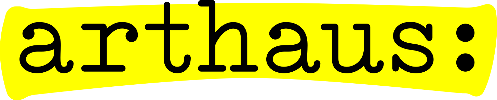
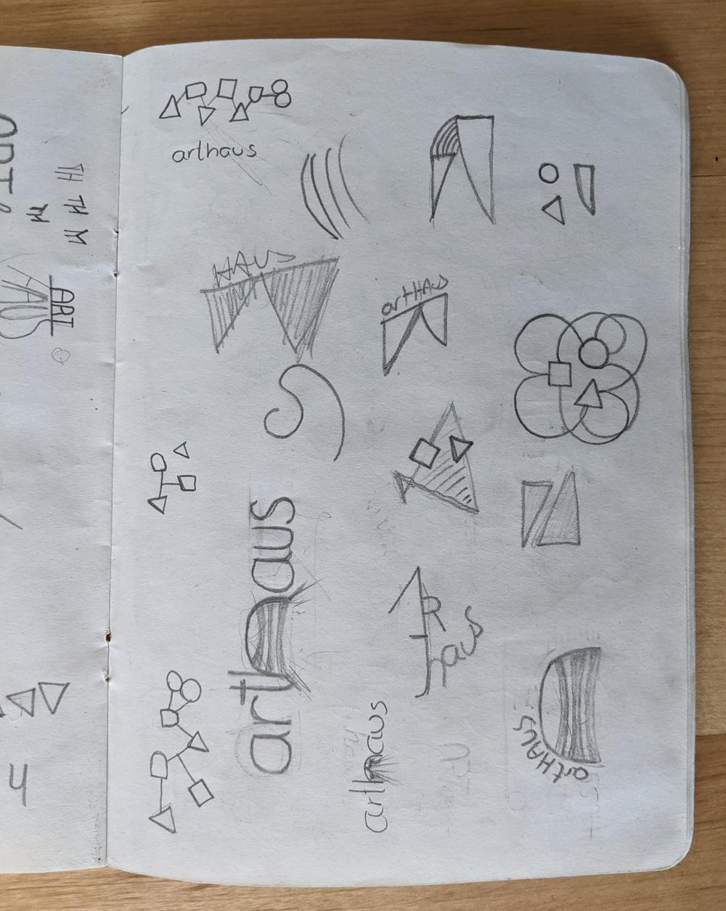
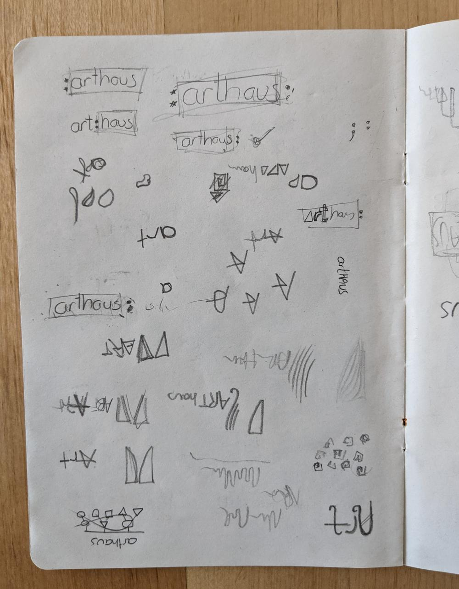
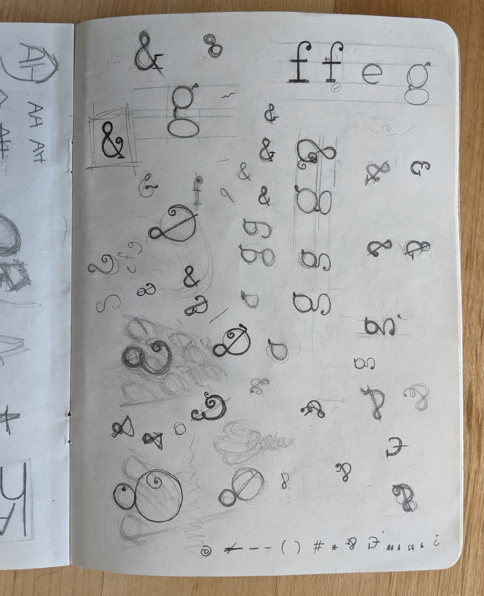
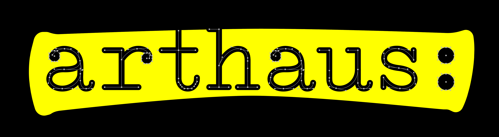
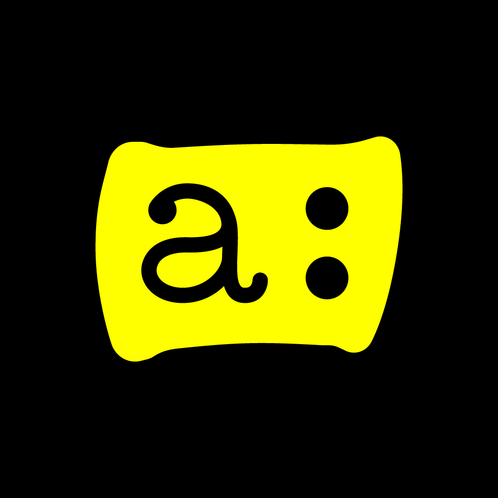

Arthaus is a magnificent voluntary organisation that I've been part of for the better part of a decade. Active in the theatre industry, Arthaus has put up dramatic and musical performances of all shapes and sizes, giving newcomers a chance to shine on stage and becoming more of a family than a run-of-the-mill performance troupe. I was in charge fo the recent rebranding efforts, assisted by one of the newer group members. We threw around a number of ideas, but eventually settled on a concept that brought to mind the time-honoured tradition of an actor highlighting their lines when receiving their script. The hand-drawn lettering was based off the typeface on an Olivetti Studio 42 typewriter.

Once complete (to the extent that any branding process can ever really be considered "complete") the branding system included logos and icons, an animated version of the logo (complete with purposefully-recorded foley on a vintage typewriter), a website, and in the sprit of overdoing things, a custom proportional-width typeface for display purposes, based on the logo lettering.

Website: https://www.arthaus.mt

- GALLERY
  - 
  - 
    
    
  - 
    
