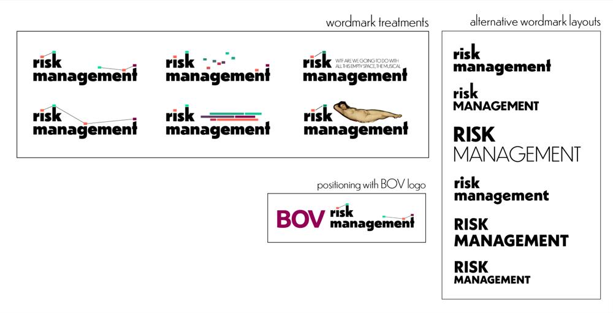
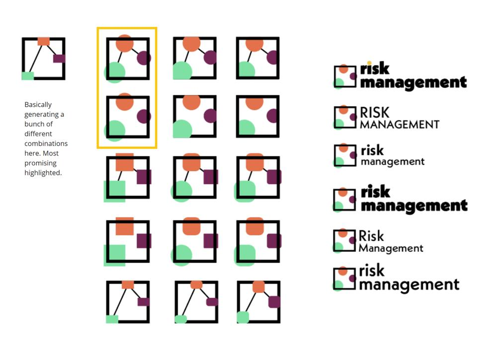
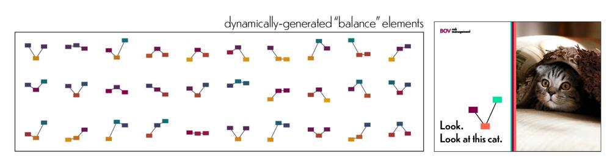
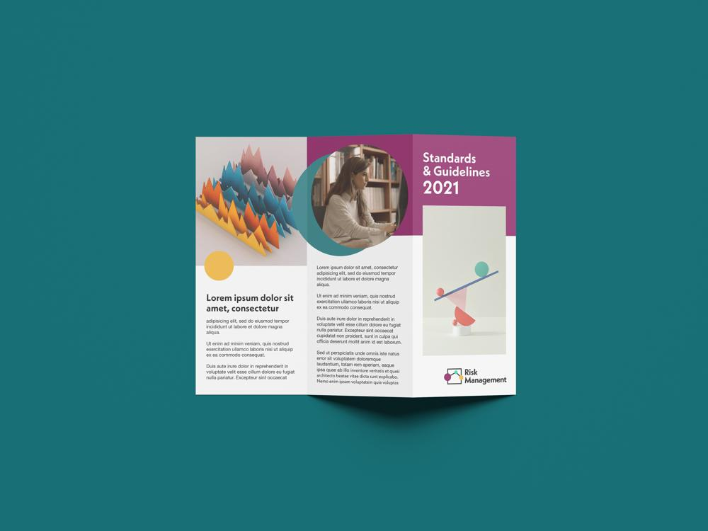
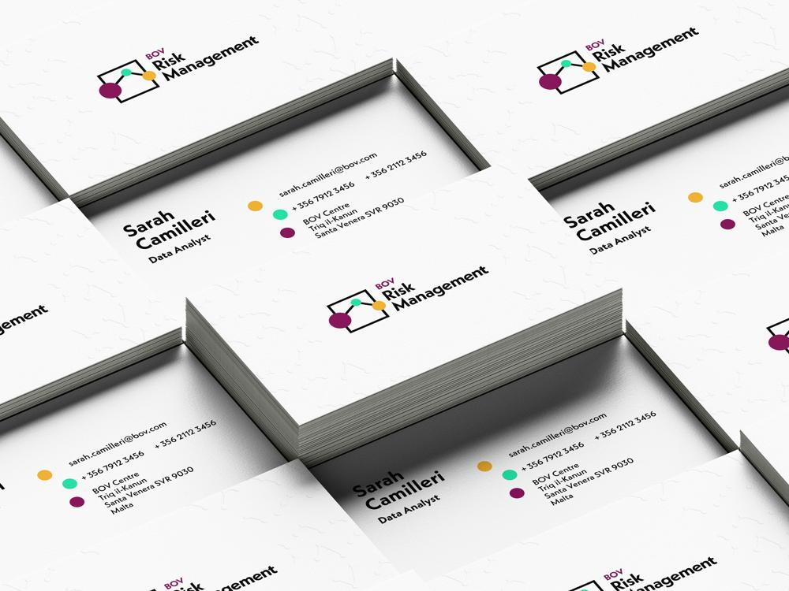
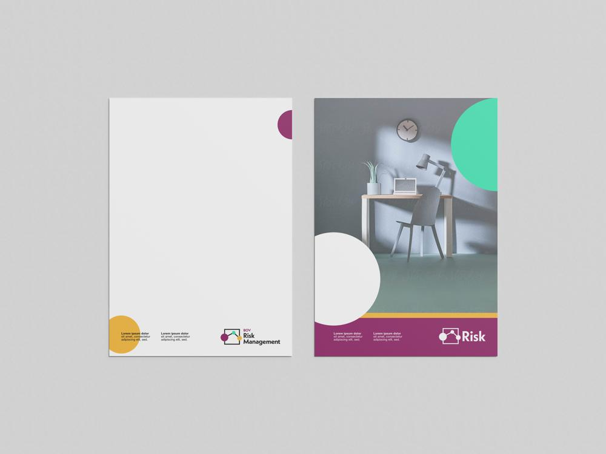
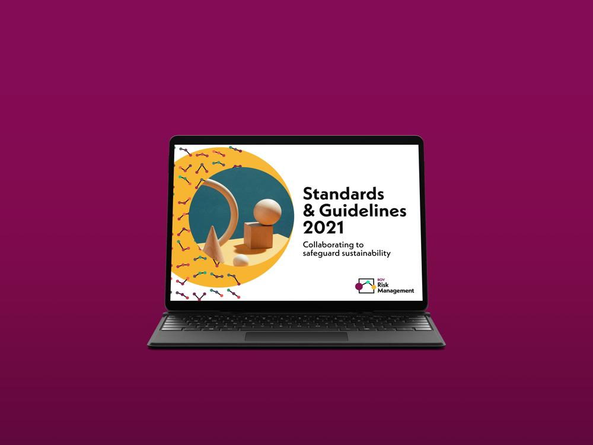

In order to highlight the importance of a proper approach to risk management in the financial world, the Risk Management Department of one of the major banks in Malta sought to brand their department for increased visibility throughout the organisation. Hand-in-hand with Matt Urpani (www.matturpani.com), I developed a complete identity system for the department, including logos, colour schemes and typography, and a dynamic pattern generator for creating logo-graphic elements based on the logo.

The idea for the logo was a combination of the idea of balancing/weighing risk, the internal networking that the Risk Department is trying to promote, data analysis and connectivity which is integral to their process, and the Risk Assessment Framework - a conceptual approach to handling financial risk within the organisation.

We went for Kabel Neue as a brand typeface as it complemented the parent brand's typeface (Helvetica) well, but also helped attain the fresh look the client was after. The colour scheme was based off the bank's primary colour (with a lot more vibrancy added).

The concepts that inspired the logo were also used to create a general graphic design system for use in all the client's branded material. In order to maximise the use of this design system, I developed an SVG generator that could be used to create branded graphical elements. This was initially written in vanilla JavaScript but eventually ported to React to facilitate easy interactive adjustments to the patterns (and possibly animation at some point, just for fun, although it seems like it will crash the browser with too many nodes in its current beta form.)

(Mock-ups by Matt Urpani.)

- GALLERY
  - 
    
  - 
    
  - 
  - 
  - 
    
  - 
    
