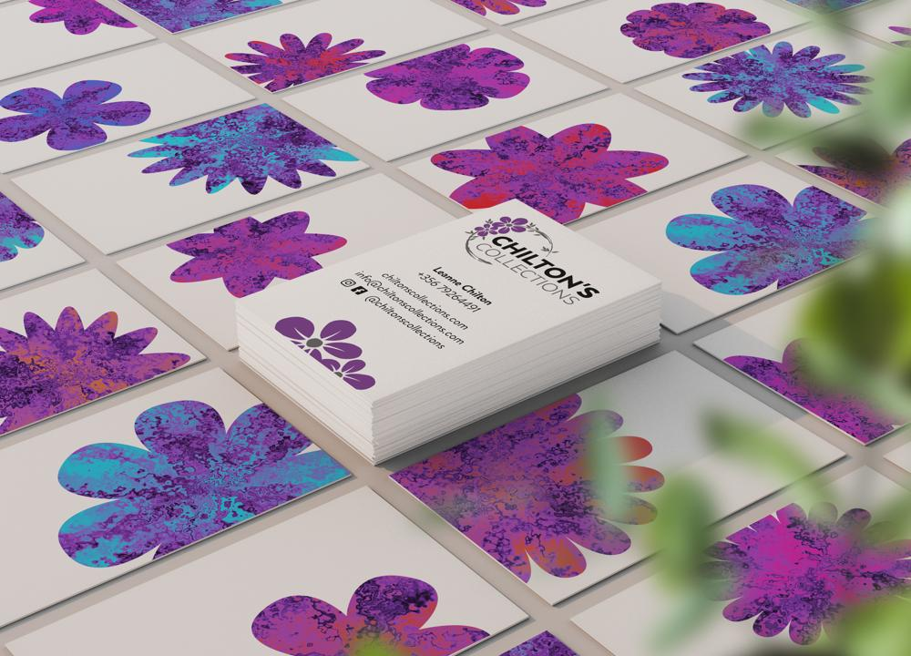
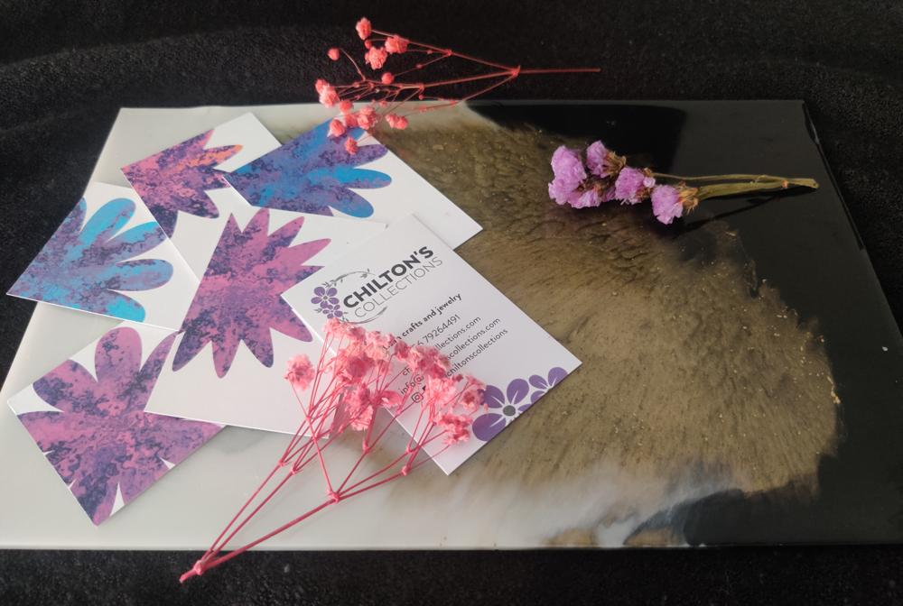
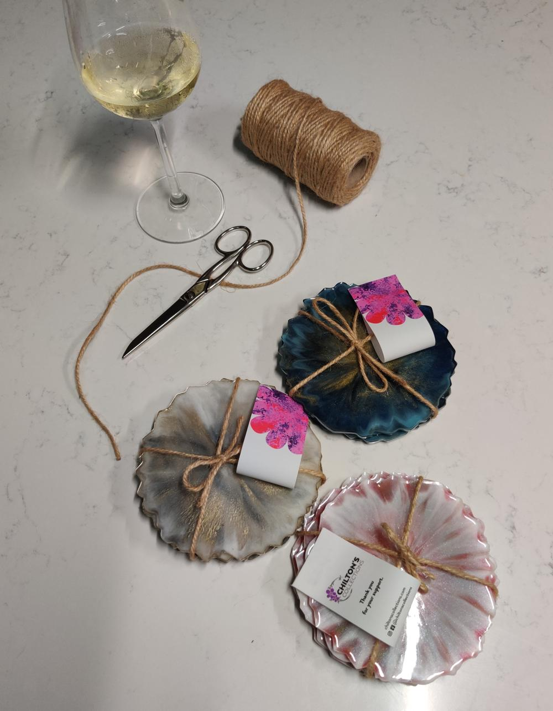

A one-woman show specialising in handmade resin artwork, Chilton's Collections needed a set of cards and tags which fit in with her existing logo and helped promote her brand. Keeping with the theme and style of the resin pieces she produced, I used After Effects to generate flower shapes (a motif on the logo) with fractal noise to imitate the patterns that emerged in the resin. The rendered frames were then used to create 250 unique business card designs, along with some tags for attaching to the products.

Check out more of Chilton's Collections here: www.facebook.com/chiltonscollections

- GALLERY
  - 
  - 
    
  - 
  - 
