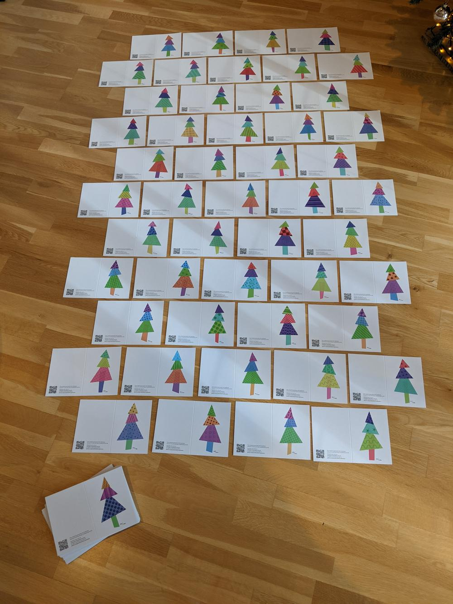
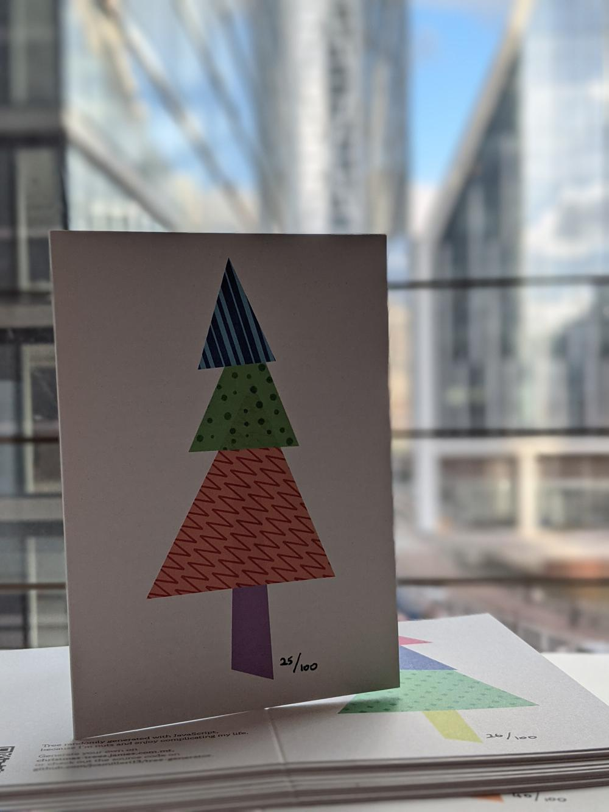
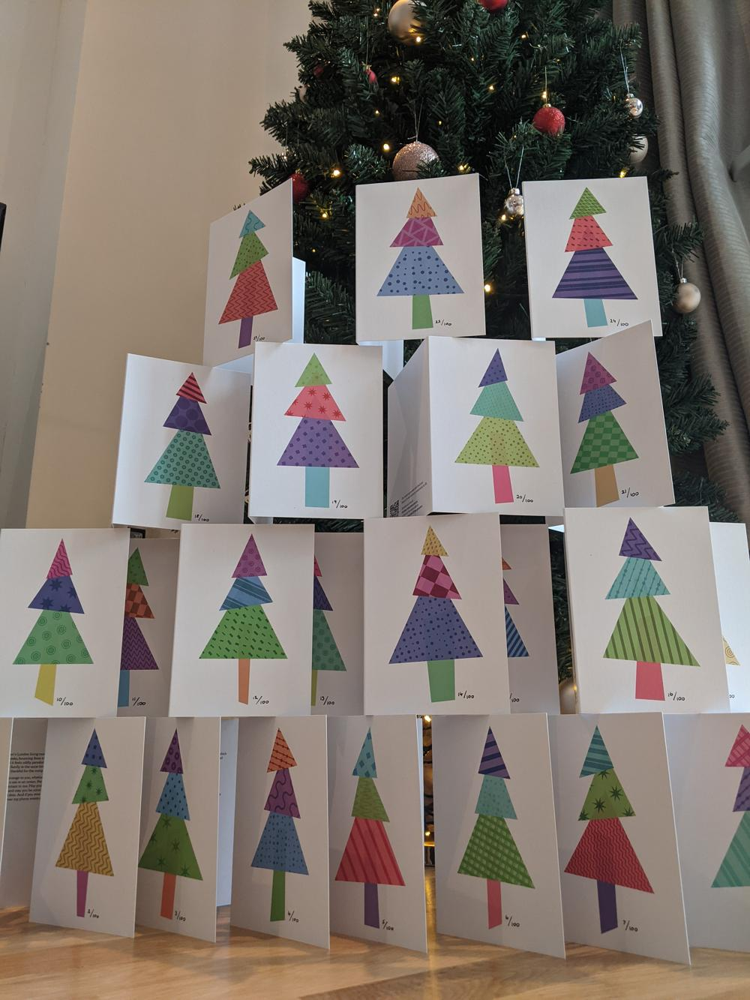
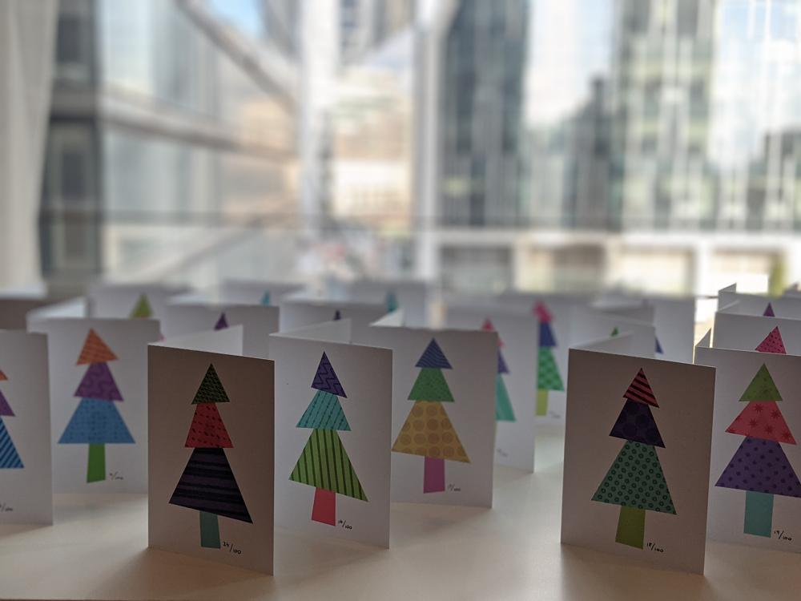
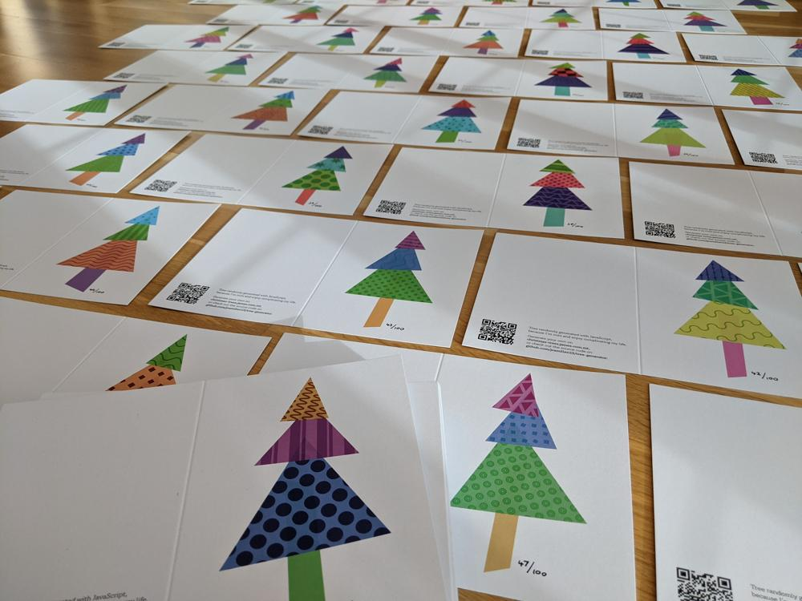

A personal project a while in the making, my Christmas Cards for 2020 were a fun little experiment in browser-based SVG artwork, and a nice balance between the digital and analogue. Each of the one hundred hand-numbered cards included a unique randomly-generated Christmas tree pattern on the front. The trees were algorithmically generated through a web browser, each composed of three random segments. The pattern for each segment was one of fifteen variations, and each of those variations had randomised sizes, orientations, and sub-variations, allowing for (effectively, if not technically) an infinite number of Christmas tree designs. The cards had a standard message (more of a soliloquy) printed inside, and were each finished off with a personal handwritten greeting.

Pattern generator: https://christmas-trees.james.mt
Source code (GitHub): https://github.com/jcamilleri13/tree-generator

- GALLERY
  - 
  - 
    
    
  - 
    
  - 
  - 
