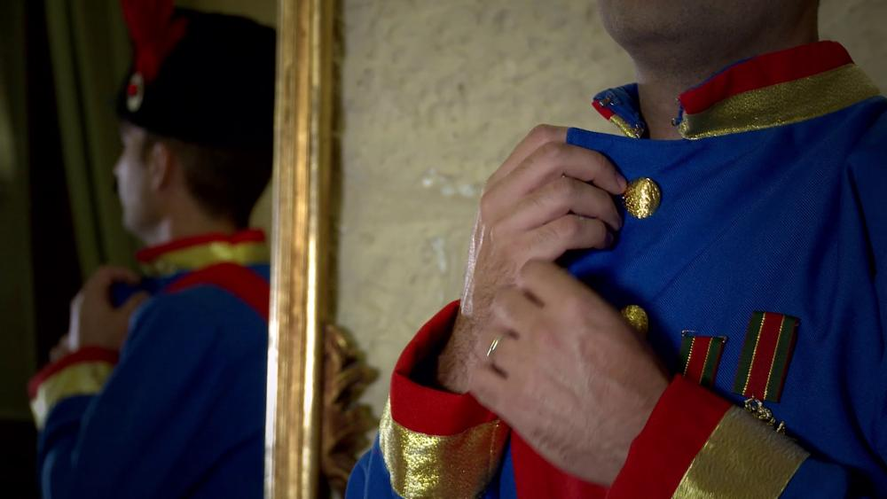
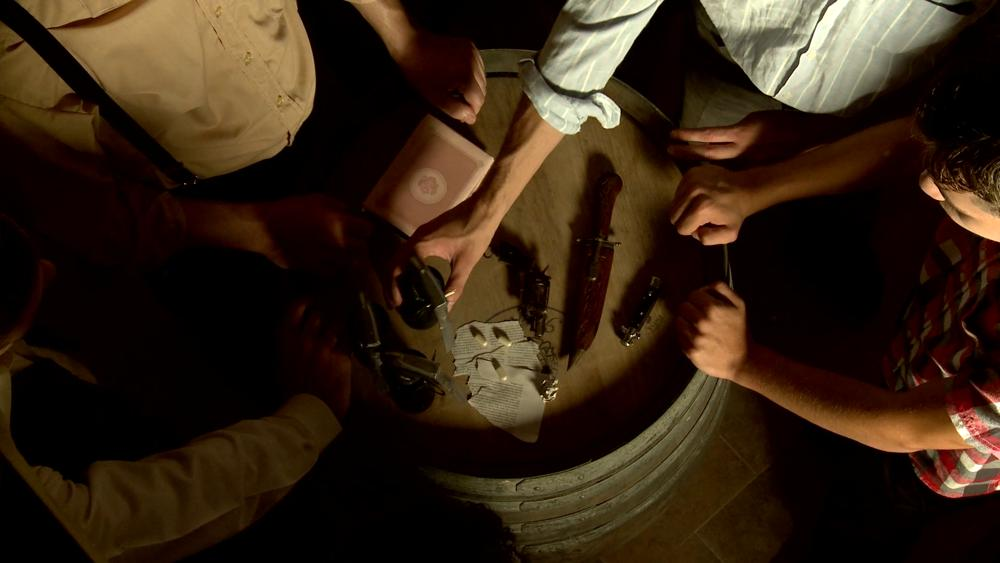
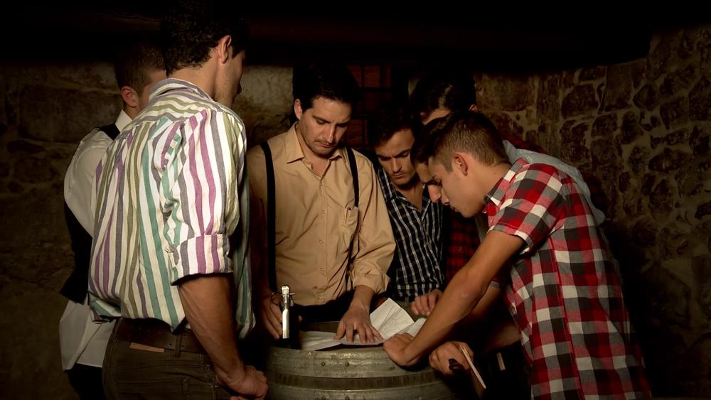
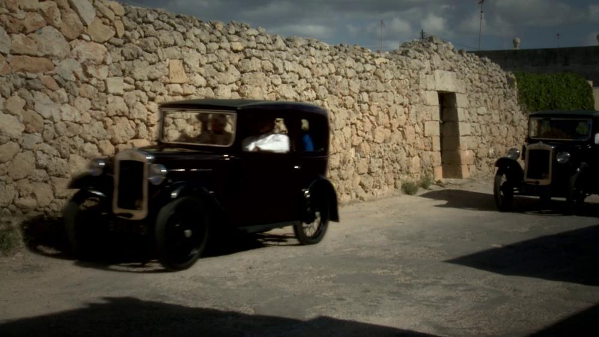
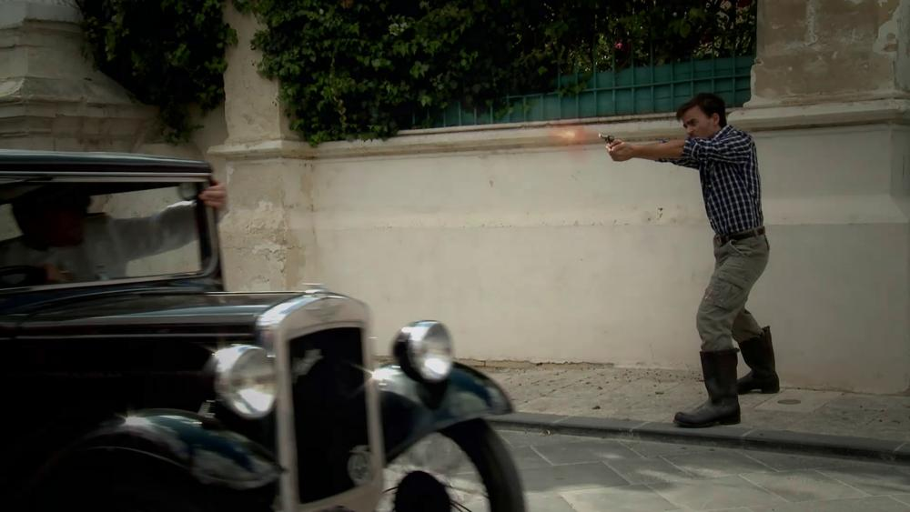

A (very) short film, unofficially titled "Franz's Bad Day", that was used in a production by the voluntary theatre organisation Arthaus. This was a(n) historical re-enactment of the assassination of Archduke Franz Ferdinand, played at the start of a walk-through performance staged in an old British fort in Madliena, Malta. I was the principal director of the piece, and handled coordinating all the ins and outs together with a hand-picked team. This included things like planning the shots, begging people to let me use their basements for filming, scouting for locations in the dead of night, asking/coercing friends and cast members to take part, badgering the police to help us with the vehicle owners who completely ignored our council-provided "No Parking" signage. An unparalleled experience. I also took care of all the animation and post-production, as well as some of the editing. Naturally, I also took part as an extra, because you never really have enough extras (especially with an effective budget of €0.) It's not exactly a groundbreaking piece of cinematic art, but given the amount of prior experience the team had and the relatively solid baseline level of quality, I'm very happy with how this turned out.

- GALLERY
  - 
  - 
    
    
  - 
    
