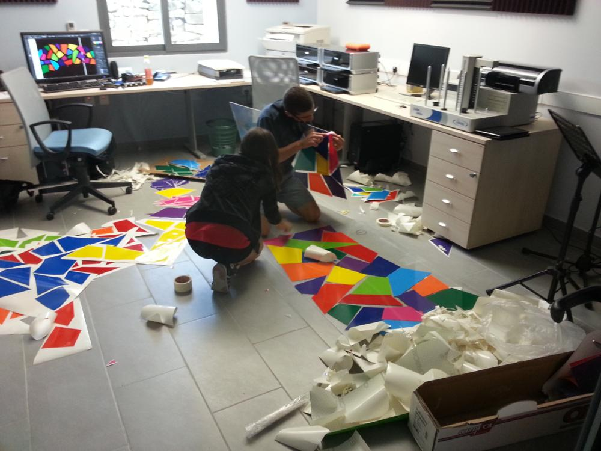
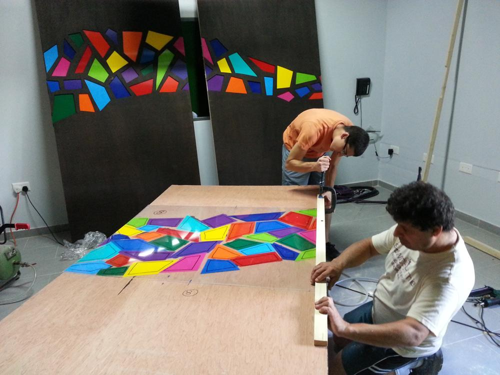
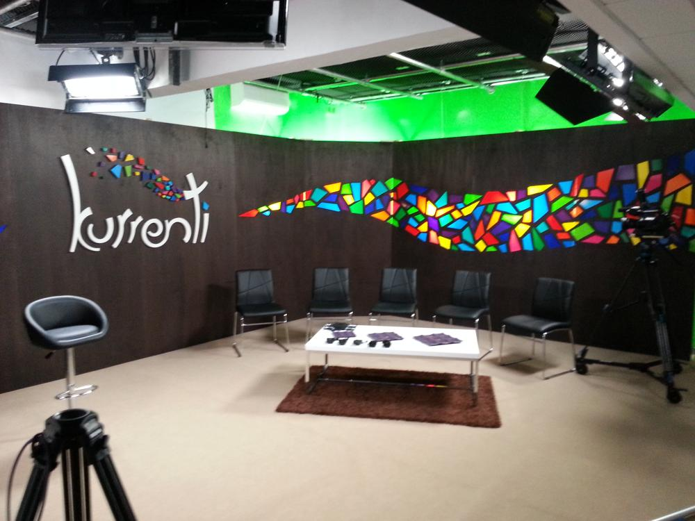
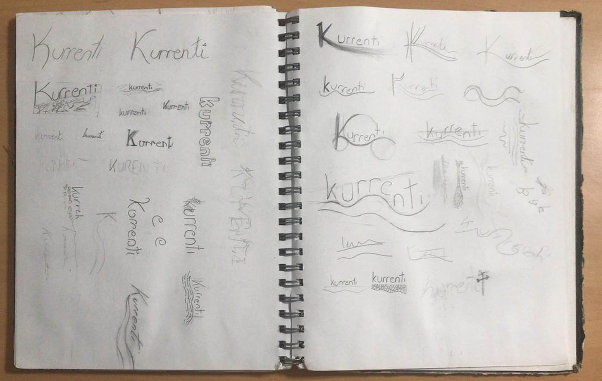
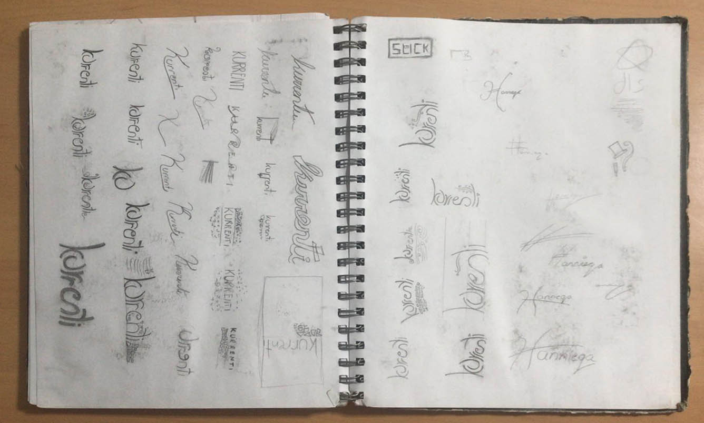

"Kurrenti" was a small-scale discussion programme that aired on Maltese television, produced by a small media house I formed part of. I designed a logotype for the programme, drawing on the dual meaning of the word current ("kurrenti" in Maltese*) -- current as in current affairs, but also as in air current. I was also tasked with designing a set for the show to be filmed on, where I carried on with the theme of tiny "wind-swept" particles from the logo. It was only after painstakingly drawing all the fragments on Illustrator that I was informed I would also be building the set. Retrospectively, I might have approached the design a little differently if I had put some more thought into the construction of the set from the get go. The fragments were cut out of thin panels of wood, then backed with clear acrylic to which coloured vinyl was attached. The set panels were backlit by diffused hanging bulbs, which created a beautiful coloured glowing effect on camera.

*Incidentally, "kurrenti" is also the Maltese name for the wooden strips used to hold most of the set together.

- GALLERY
  - 
    
  - 
  - 
    
