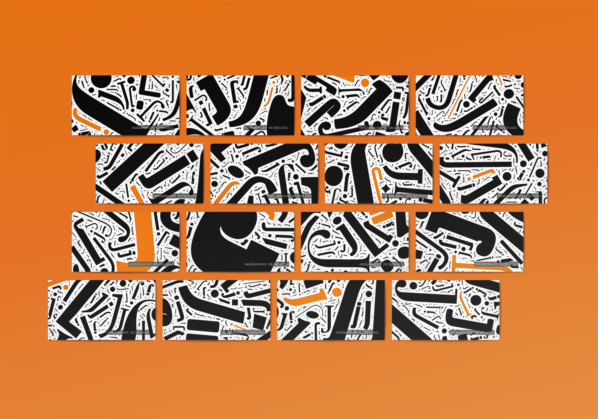
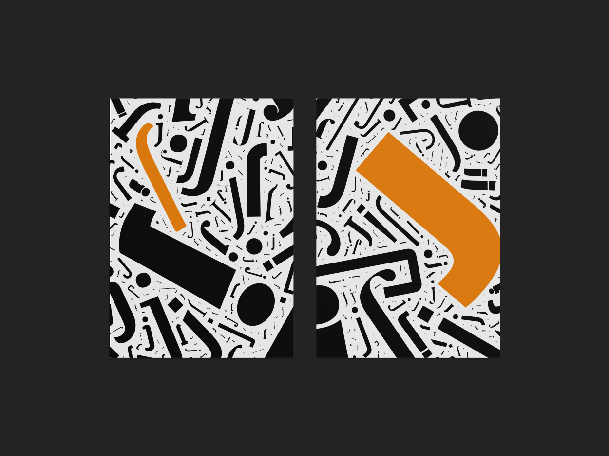
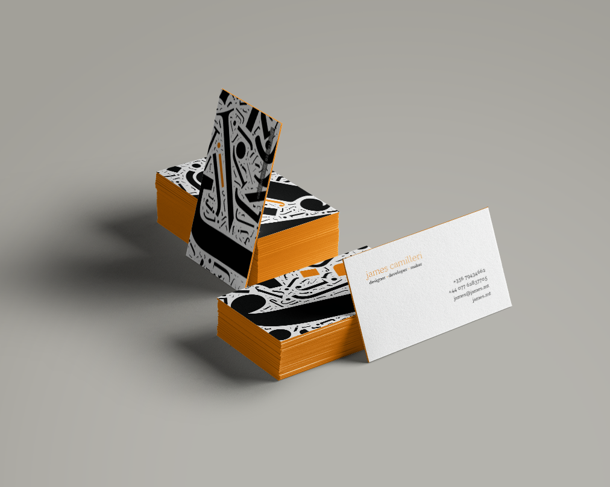

My own personal branding effort is still very much a work in progress, mostly because of the amount of time it took to get the code for the dynamically generated elements right. Intended to be a combination of my love for typography and my slight obsession with the colour orange, the brand (when finally complete) will heavily feature a randomly-generated pattern of tiled letter Js. To this effect, I developed an online shape-tiling engine based off the Wordle algorithm by Jonathan Feinburg (See http://static.mrfeinberg.com/bv_ch03.pdf). The algorithm was fully re-implemented in TypeScript, including a few tweaks to get the effect I was after and some hand-rolled collision detection code based on prior art. (Getting the collision detection right was by far the trickiest part.)

Each business card, postcard, letterhead, and so forth will have a unique (numbered) background, to showcase the algorithmic design. The pattern generation will also eventually be used as a dynamic background pattern for my website.

**SVG Tiler**: https://madum-ts.james.mt/

- GALLERY
  - 
  - 
    
  - 
  - 
