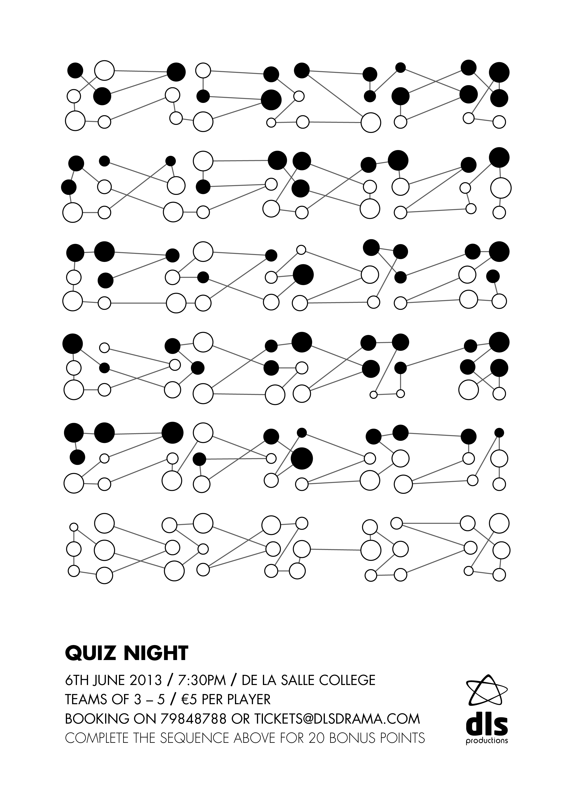
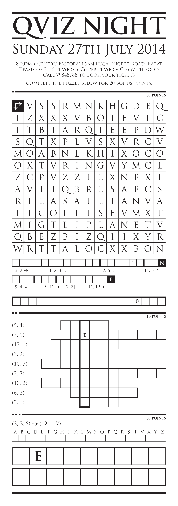

While these two posters are hardly groundbreaking designs, the fact that they directly engage the viewer by giving them a puzzle to solve makes them a bit different from the usual promotion. Answers are at the bottom of the page if your curiosity gets the better of you.

(The second one requires you to actually visit somewhere, so unless you're in Malta I'm afraid you won't be able to solve that fully.)

- GALLERY
  - 
  - 
  - 
