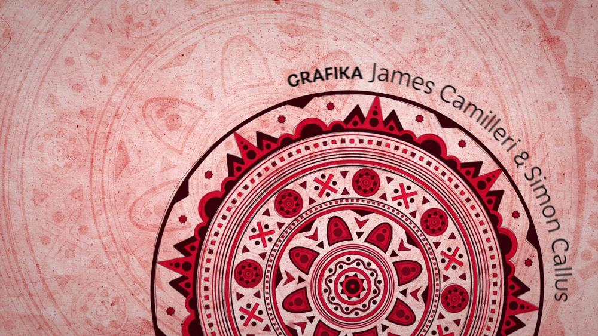
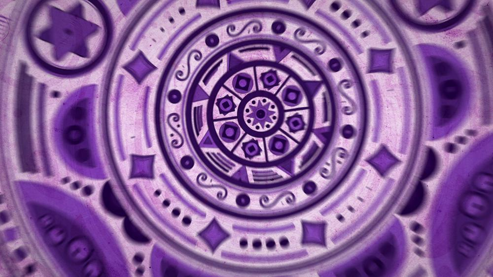
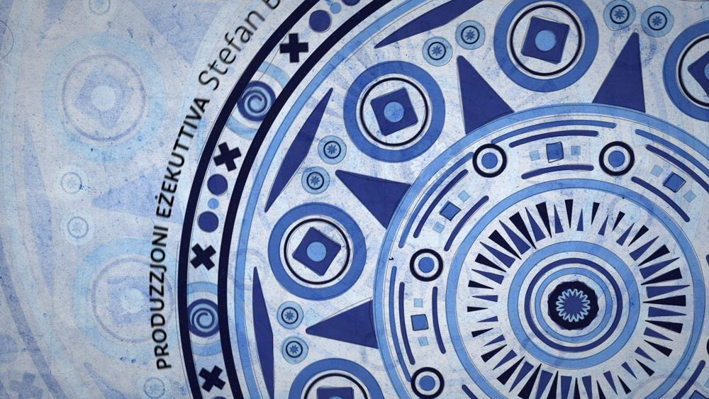
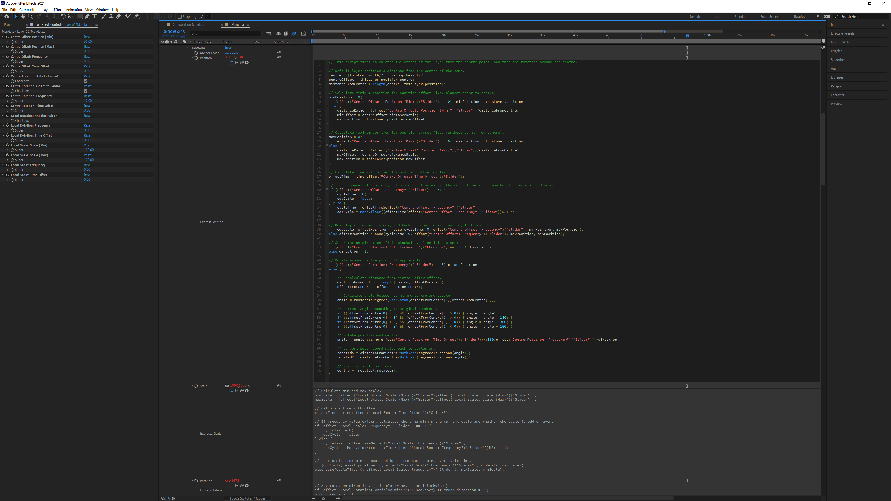

This was one of those manic projects where we were briefed on Thursday and then gently informed that the whole thing had to be done by Monday. I was tasked with planning (and producing) a graphical opening sequence for a socio-religious TV programme on Maltese television. Given the social aspect of the programme I was inspired by the Buddhist mandala* artwork, and pitched the idea of animated geometric patterns to open the programme. I designed the mandala patterns on Illustrator and split them into hundreds of individual layers for animation. A colleague and I then spent the entire weekend embellishing the designs and animating each component. I used the scripting capacity of After Effects to more efficiently animate the components around the centre of the pattern, allowing us to easily tweak the rotation, scale, and position of each fragment without having to manually animate each piece, which saved days off the implementation and possibly weeks off my life.

*Granted, the religion part of the socio-religious category was very Western, but given that all major religions are on board with a united humanity, and the "mandala" patterns would be extremely abstract, I hazarded that this would work as a concept without being too obviously symbolic.

- GALLERY
  - 
  - 
    
    
  - 
