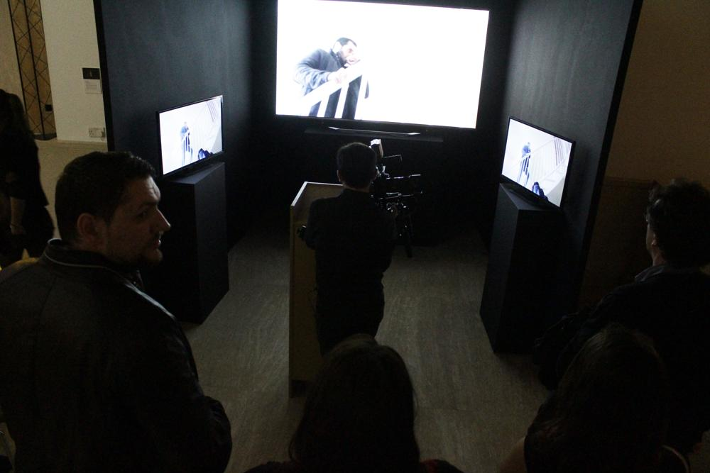
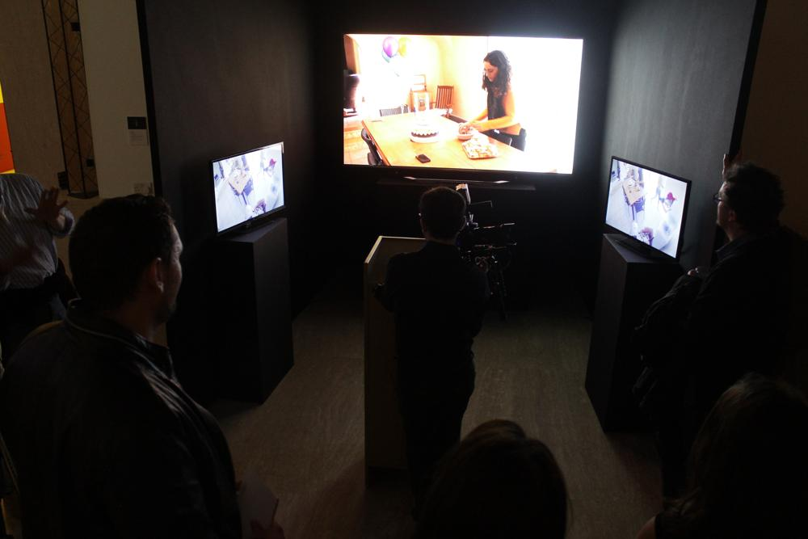

A collaboration with a dear friend and brilliant mind, "Simultaneously Upon a Time" was an experiment in interactive film-making, using software to put viewers in the driver's seat of a cinematic experience. The idea was that the audience could switch between multiple simultaneous shots of the same story, allowing them to choose whose point of view they wanted to follow, but at the same time denying them an "omniscient" outlook of the event. Simon Callus, who submitted the project as a thesis for a Masters in Fine Arts in Digital Arts, was the brains behind the operation. My contributions included some logistics, cinematography on filming day, writing all the software for the installation and online versions of the piece, wiring up the control console, and convincing Simon to go from three to six simultaneous shots with twelve cameras -- because anything worth doing is worth overdoing.

The exhibition installation ran as a Universal Windows App (on a Mac Mini, somehow) which was hooked up to a custom-built console powered by an Arduino Micro. The Micro can send keypresses over USB, so it was used to send numeric keys when the large light-up blue buttons were pressed. The (eventual) online implementation under 100 lines of vanilla JavaScript, which I will attribute to either Web technology improving or my competence increasing somewhat.

The piece can be experienced online here: https://simultaneously.xmuncallus.com/, or you can read a bit more about it on Simon's site here: https://www.xmuncallus.com/videoreel#/simultaneously/

- GALLERY
  - 
    
  - 
